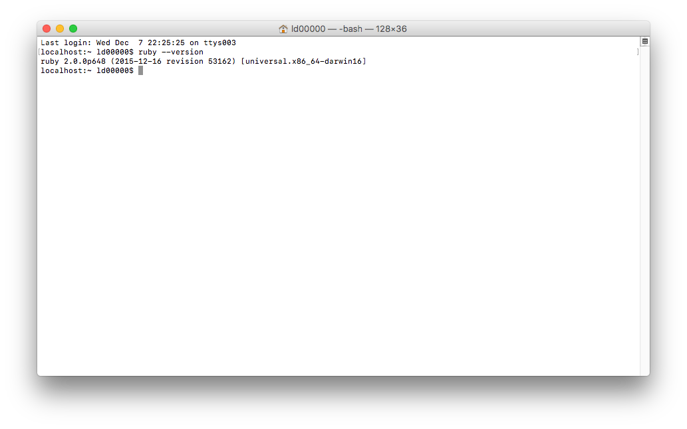

# 申请 github-pages
---
> 源地址 https://pages.github.com/

1. 创建一个仓库
在 github 建立一个新仓库，命名为 `username.github.io`，用自己的用户名替换 `username`。**note: 如果用户名不匹配，将会不起作用。**

2. clone 项目 `git clone https://github.com/username/username.github.io`

3. 创建 hello world。`cd username.github.io && echo "Hello World" > index.html`

4. push 项目。`git add --all && git commit -m "Initial commit" && git push -u origin master`

5. 访问 `http://username.github.io`，就能看到刚刚创建的网站了。

# 搭建 jekyll 环境
---

输入 `ruby --version` 验证是否安装了 `ruby`（Mac 已经预装了）


安装 jekyll，输入 `gem install jekyll`

删除之前的 `index.html`，运行 `jekyll new .`，jekyll 就会自动生成一些博客的基础文件和目录。输入 `jekyll serve`，就可以访问了。默认地址 `http://127.0.0.1:4000/`。

还可以在 `_config.yml` 中进行一些个性化配置。

# 安装模板

```
Gem::Ext::BuildError: ERROR: Failed to build gem native extension.

    current directory: /Library/Ruby/Gems/2.0.0/gems/nokogiri-1.6.8.1/ext/nokogiri
/System/Library/Frameworks/Ruby.framework/Versions/2.0/usr/bin/ruby -r ./siteconf20161208-38005-ye53g2.rb extconf.rb
checking if the C compiler accepts ... yes
checking if the C compiler accepts -Wno-error=unused-command-line-argument-hard-error-in-future... no
Building nokogiri using packaged libraries.
Using mini_portile version 2.1.0
checking for iconv.h... yes
checking for gzdopen() in -lz... yes
checking for iconv... yes
************************************************************************
IMPORTANT NOTICE:

Building Nokogiri with a packaged version of libxml2-2.9.4.

Team Nokogiri will keep on doing their best to provide security
updates in a timely manner, but if this is a concern for you and want
to use the system library instead; abort this installation process and
reinstall nokogiri as follows:

    gem install nokogiri -- --use-system-libraries
        [--with-xml2-config=/path/to/xml2-config]
        [--with-xslt-config=/path/to/xslt-config]

If you are using Bundler, tell it to use the option:

    bundle config build.nokogiri --use-system-libraries
    bundle install

Note, however, that nokogiri is not fully compatible with arbitrary
versions of libxml2 provided by OS/package vendors.
************************************************************************
Extracting libxml2-2.9.4.tar.gz into tmp/x86_64-apple-darwin16/ports/libxml2/2.9.4... OK
Running 'configure' for libxml2 2.9.4... OK
Running 'compile' for libxml2 2.9.4... ERROR, review
'/Library/Ruby/Gems/2.0.0/gems/nokogiri-1.6.8.1/ext/nokogiri/tmp/x86_64-apple-darwin16/ports/libxml2/2.9.4/compile.log' to see what happened. Last lines are:
========================================================================
  CCLD     libxml2.la
  CC       testdso.lo
  CCLD     testdso.la
  CC       xmllint.o
  CCLD     xmllint
ld: warning: ignoring file /usr/local/Cellar/xz/5.2.2/lib/liblzma.dylib, file was built for x86_64 which is not the architecture being linked (i386):
/usr/local/Cellar/xz/5.2.2/lib/liblzma.dylib
Undefined symbols for architecture i386:
  "_lzma_auto_decoder", referenced from:
      _xz_head in libxml2.a(xzlib.o)
  "_lzma_code", referenced from:
      _xz_decomp in libxml2.a(xzlib.o)
  "_lzma_end", referenced from:
      ___libxml2_xzclose in libxml2.a(xzlib.o)
  "_lzma_properties_decode", referenced from:
      _is_format_lzma in libxml2.a(xzlib.o)
ld: symbol(s) not found for architecture i386
clang: error: linker command failed with exit code 1 (use -v to see invocation)
make[2]: *** [xmllint] Error 1
make[1]: *** [all-recursive] Error 1
make: *** [all] Error 2
========================================================================
*** extconf.rb failed ***
Could not create Makefile due to some reason, probably lack of necessary
libraries and/or headers.  Check the mkmf.log file for more details.  You may
need configuration options.

Provided configuration options:
	--with-opt-dir
	--without-opt-dir
	--with-opt-include
	--without-opt-include=${opt-dir}/include
	--with-opt-lib
	--without-opt-lib=${opt-dir}/lib
	--with-make-prog
	--without-make-prog
	--srcdir=.
	--curdir
	--ruby=/System/Library/Frameworks/Ruby.framework/Versions/2.0/usr/bin/ruby
	--help
	--clean
	--use-system-libraries
	--enable-static
	--disable-static
	--with-zlib-dir
	--without-zlib-dir
	--with-zlib-include
	--without-zlib-include=${zlib-dir}/include
	--with-zlib-lib
	--without-zlib-lib=${zlib-dir}/lib
	--enable-cross-build
	--disable-cross-build
/Library/Ruby/Gems/2.0.0/gems/mini_portile2-2.1.0/lib/mini_portile2/mini_portile.rb:366:in `block in execute': Failed to complete compile task (RuntimeError)
	from /Library/Ruby/Gems/2.0.0/gems/mini_portile2-2.1.0/lib/mini_portile2/mini_portile.rb:337:in `chdir'
	from /Library/Ruby/Gems/2.0.0/gems/mini_portile2-2.1.0/lib/mini_portile2/mini_portile.rb:337:in `execute'
	from /Library/Ruby/Gems/2.0.0/gems/mini_portile2-2.1.0/lib/mini_portile2/mini_portile.rb:111:in `compile'
	from /Library/Ruby/Gems/2.0.0/gems/mini_portile2-2.1.0/lib/mini_portile2/mini_portile.rb:150:in `cook'
	from extconf.rb:365:in `block (2 levels) in process_recipe'
	from extconf.rb:258:in `block in chdir_for_build'
	from extconf.rb:257:in `chdir'
	from extconf.rb:257:in `chdir_for_build'
	from extconf.rb:364:in `block in process_recipe'
	from extconf.rb:263:in `tap'
	from extconf.rb:263:in `process_recipe'
	from extconf.rb:556:in `<main>'

To see why this extension failed to compile, please check the mkmf.log which can be found here:

  /Library/Ruby/Gems/2.0.0/extensions/universal-darwin-16/2.0.0/nokogiri-1.6.8.1/mkmf.log

extconf failed, exit code 1

Gem files will remain installed in /Library/Ruby/Gems/2.0.0/gems/nokogiri-1.6.8.1 for inspection.
Results logged to /Library/Ruby/Gems/2.0.0/extensions/universal-darwin-16/2.0.0/nokogiri-1.6.8.1/gem_make.out

An error occurred while installing nokogiri (1.6.8.1), and Bundler cannot continue.
Make sure that `gem install nokogiri -v '1.6.8.1'` succeeds before bundling.
```

brew uninstall --ignore-dependencies xz

bundle update
